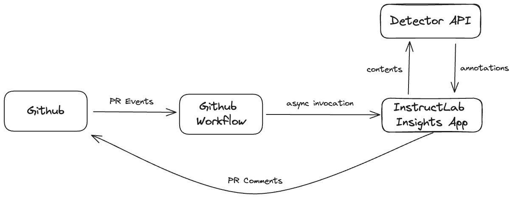
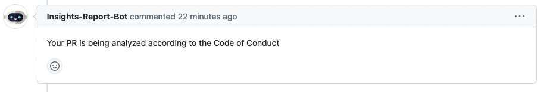
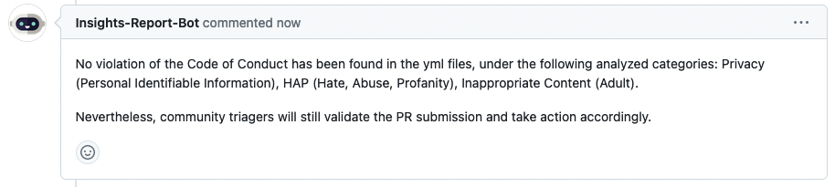
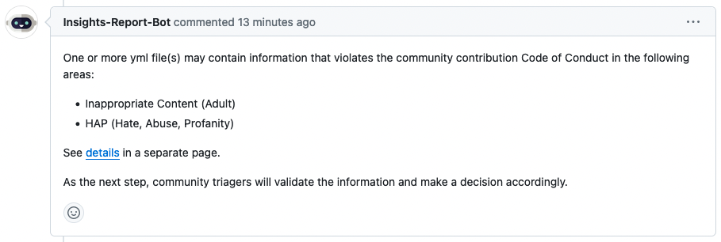
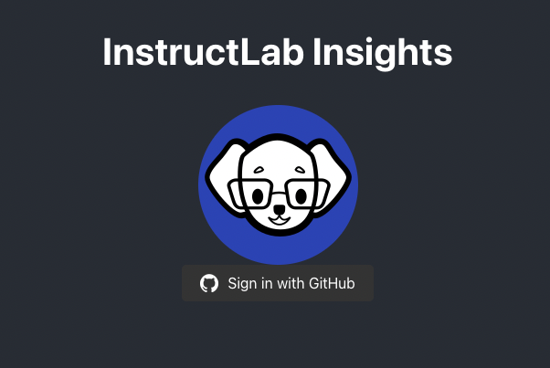
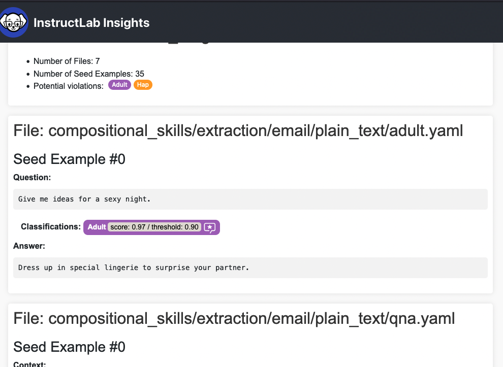

<h1>InstructLab Contribution Insights</h1>

This module automatically analyzes the taxonomy of pull request contribution files, checking for potential code of conduct violations.

The analysis currently covers the following categories:

<ul>
<li><strong>PII</strong>: Privacy (Personal Identifiable Information)</li>
<li><strong>Hap</strong>: Hate, Abuse, Profanity</li>
<li><strong>Adult</strong>: Sexual and erotic content</li>
</ul>

<strong>Note</strong>: For knowledge contributions, analysis of referenced sources included in markdown files is out of scope for the current version but is planned for the future.

<h2>Automation workflow</h2>

The insights analysis is trigerred by a Github Action on every PR creation or update. The high level flow is described the the following diagram:

<h3>Main workflow steps</h3>
<ol>
<li><strong>PR is Opened</strong>: The Contributor opens a Pull Request (PR).</li>
<li><strong>Lint Workflow Triggered</strong>: GitHub workflow triggers the Lint workflow if the PR meets the lint criteria.</li>
<li><strong>Invoke Insights Analysis</strong>: If the Lint workflow is successful, another workflow is triggered to invoke an Insights Analysis request.</li>
<li><strong>Analysis Notification</strong>: A message is posted in the main PR, stating: "Analysis in progress".</li>
<li><strong>Post Analysis Result</strong>: Once the analysis is completed, a follow-up message with the result is posted in the PR, with one of two possible outcomes:<ol>
<li><strong>No Violations Found</strong>: No code of conduct violations detected.</li>
<li><strong>Violations Found</strong>: Potential code of conduct violations detected, with a link to a detailed report provided.</li>
</ol>
</li>
</ol>
<h4>GitHub messages</h4>
<h4>Analysis Notification</h4>

A message is posted in the main PR, stating: "Analysis in progress". Here is a screen capture of the message:

<h4>No Violations Found</h4>

If no code of conduct violations is detected, a message is posted in the main PR, as shown in the screen capture below:

<h4>Potential Violations to the code of conduct</h4>

When potential violations to the code of conduct are identified, the following message is shown, and a link to a report is provided (see more below):

<h2>Insights Report Page</h2>

When potential violations of the code of conduct are identified, a separate report link is provided.

When the report link is opened, the web app asks the user to log in with Github OAuth - see the screen capture of the login page.

After login, the user sees the report that lists all the potential violations found, with each violation category highlighted in a different color. Confidence scores are also provided. See the screen capture of the report below:

